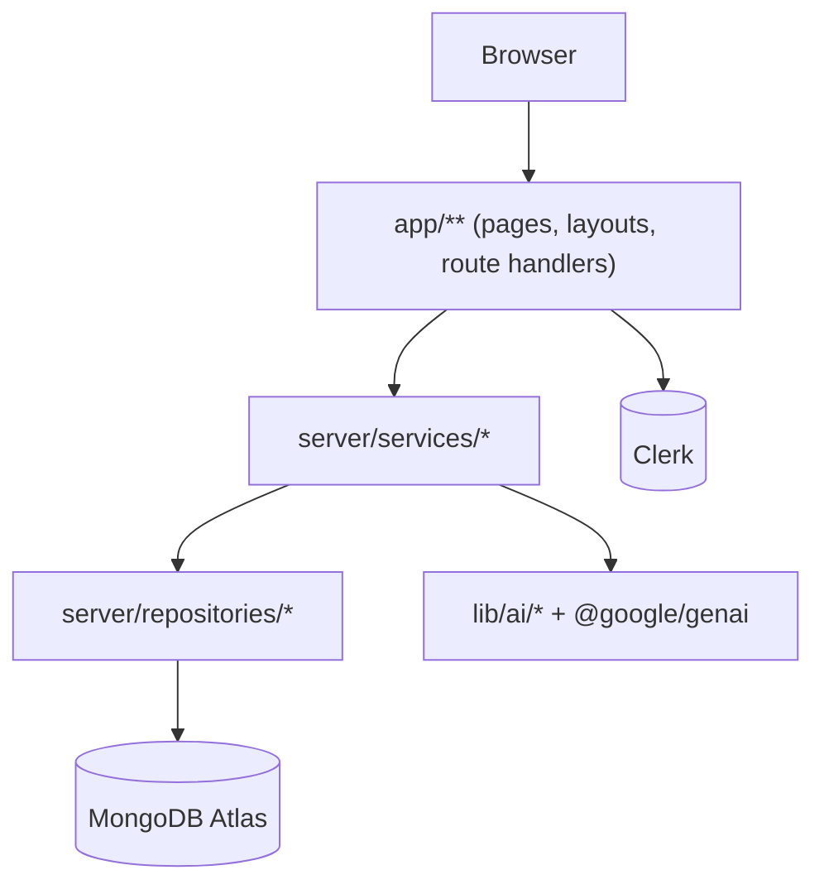
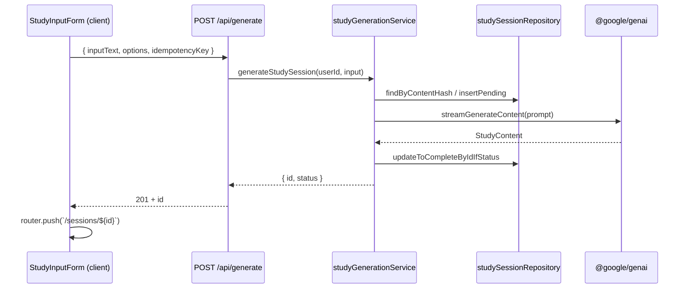

# Architecture

Smart Study Platform is a Next.js App Router application backed by MongoDB
Atlas and Clerk. Everything is server-first; client components are only used
for interaction-heavy surfaces.

## Layer map

Rule of thumb: each arrow is one-way. A repository never calls a service, a
service never renders UI, a route handler never talks to MongoDB directly.

## Directories

- `app/` — Next.js routes, layouts, and route handlers (`app/api/**`). Uses
  route groups:
  - `app/(public)` — marketing, sign-in / sign-up
  - `app/(dashboard)` — authenticated surfaces (`noindex`)
  - `app/api` — JSON route handlers
- `components/ui/` — shared primitives (see [design-system.md](./design-system.md))
- `components/features/<domain>/` — composed, feature-specific components
- `components/shell/` — layout chrome (topbar, sidebar, shell)
- `hooks/` — client-only React hooks
- `lib/` — shared utilities usable from both client and server
  (`cn`, `toast`, `auth`, `mongodb`, `env`, `ai/*`, `errors`)
- `models/` — persistence contracts (MongoDB document types)
- `server/`
  - `server/services/` — business logic, transactional flows, imports `lib/*`
  - `server/repositories/` — thin wrappers around MongoDB collections; own
    index creation and query shape
- `config/` — declarative app config (e.g. navigation)

## Data flow: "generate a study session"

Failure paths:

- Invalid input — 400 from API, inline `Alert` under the form.
- Gemini error — persisted on the session as `status: "error"`, retried via the
  "Retry with same text" button in `SessionResults`.
- Transient 429 / 5xx — inline `Alert` + `retry-after` seconds display.

## Auth

`ClerkProvider` wraps the root layout (`app/layout.tsx`). Every server route
under `(dashboard)` and every handler under `app/api` calls
`getUserIdOrThrow()` from `lib/auth.ts` before doing any work. Sessions are
scoped to `userId` at the repository layer — there is no cross-user read path.

## Search

`GET /api/sessions?q=<text>` runs a MongoDB `$text` search against a
compound text index on `inputText` (weight 3) and `result.summary` (weight 1).
Results are sorted by recency, not by text score, because users ask for
"my most recent session about X".

See `server/repositories/studySessionRepository.ts → ensureStudySessionIndexes`
for all indexes, including:

- `{ userId, createdAt, _id }` — list pagination
- `{ userId, idempotencyKey }` — idempotent generation
- `{ userId, contentHash, status, createdAt }` — content-hash reuse
- `{ inputText: "text", "result.summary": "text" }` — full-text search

## State management

There is no global client store. Three reasons:

1. Server state lives on the server and is refetched per-route.
2. Loading/error states are per-feature (`usePollSession` is the template).
3. Toasts are the only cross-tree UI channel; `sonner` owns that.

If you need to share state across unrelated components, first ask whether the
URL can hold it (`?q=`, `?tab=`, `?retry=1`). It usually can.

## Testing

Vitest is the only runner. Tests live next to source
(`lib/cn.test.ts` next to `lib/cn.ts`). Keep them hermetic — no network, no
real MongoDB. See `vitest.config.ts` for config.

## Deployment

The app is a standard Next.js project and runs unchanged on Vercel / Node 20+.
Environment variables are parsed via `lib/env.ts`, which fails fast if a
required variable is missing. See `.env.example` for the list.
